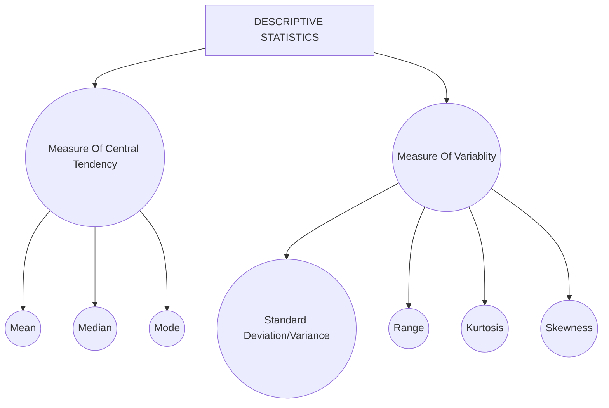

# Descriptive Statistics

- It is a summary statistics that quantitatively describe or summarizes features from a collection of information.

`In simple words, It help us to understand what a bunch of numbers means by providing simple information about like spread,average etc.`

- Note : `Central Tendency` and `Variablity` is generally used for Univariate analysis to understand distribution of single variable.

## Central Tendency

### Mean

- For a given dataset, the arthematic mean/arthematic average is a measure of central tendency of finite set of numbers. Specially `the sum of the values devided by the number of values`.

`Example` -> Let x be set of number [ x1, x2, x3,x4, ......, xn ], then the arthematic mean is represented by x̅.

  
